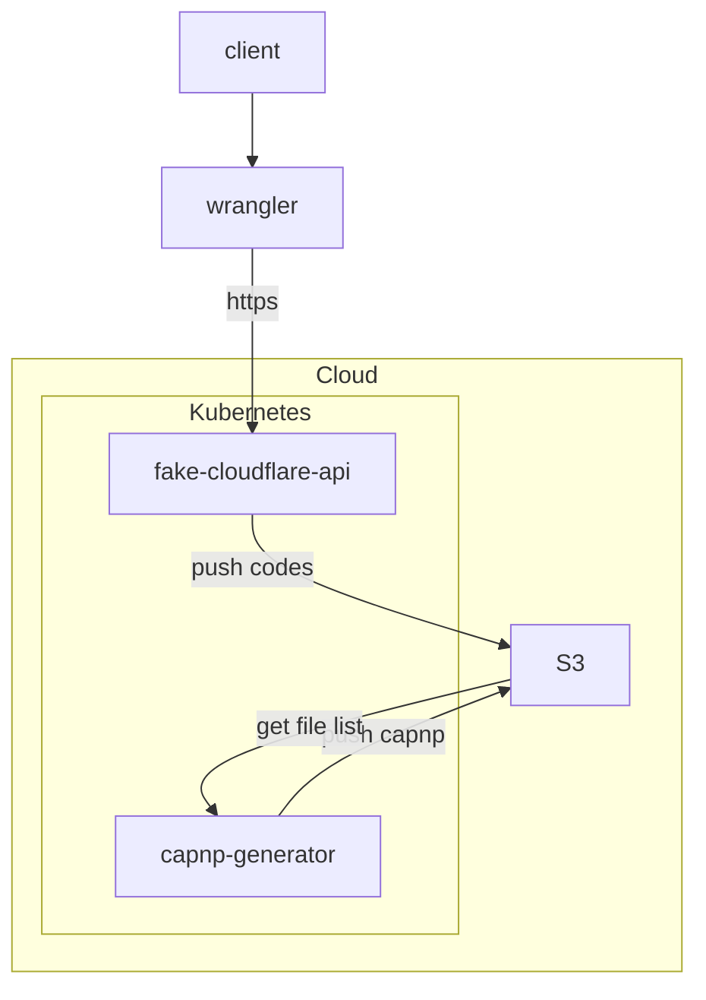

# capnp-generator

This project automatically generates Cap'n'Proto files from JavaScript/Wasm files stored in any S3 bucket.

## Overview

1. [Installation](#installation)
2. [Configuration](#configuration)
3. [Usage](#usage)
    1. [Production Mode](#production-mode)
    2. [Development Mode](#development-mode)
4. [Example Usage](#example-usage)

## Installation

To install the project, run `yarn` or `npm i`

## Configuration

To configure the project, follow these steps:

1. Install the AWS Command Line Interface (CLI) by running `pip install awscli`.
2. Run `aws configure` and provide your public access key and private key.

> **Note**:
> This project has been implemented using Scaleway Object Storage S3. If you want to use a similar setup,
> please refer to [this tutorial](https://www.scaleway.com/en/docs/storage/object/api-cli/object-storage-aws-cli/).

## Usage

### Production mode

To run the project in production mode, use the command `yarn start` or `npm start`

### Development Mode

To run the project in development mode, use the command `yarn run dev` or `npm run dev`

## Example Usage

If you are using [The Fake Cloudflare API](https://github.com/clementreiffers/fake-cloudflare-api),
you can push your code to an S3 bucket. The S3 bucket will then call the **capnp-generator** to generate the required 
configuration file for the [Workerd Runtime](https://github.com/cloudflare/workerd), and save the configuration in the S3 bucket.

